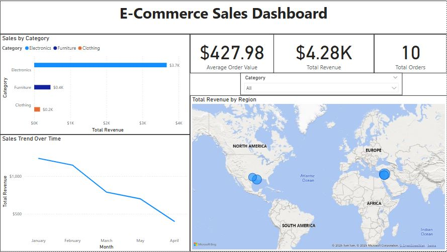
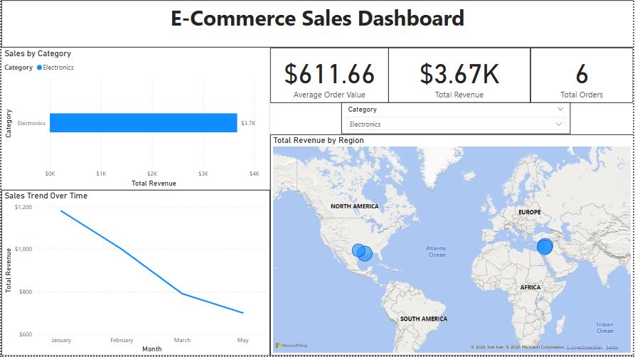

# Power BI E-Commerce Sales Dashboard

## Overview
This project features an interactive Power BI dashboard designed to analyze sales data for a fictional e-commerce company. The dashboard visualizes key performance indicators (KPIs), sales trends, and regional performance, showcasing skills in data modeling, DAX calculations, and data visualization.

## Features
- **KPIs**: Total Revenue, Average Order Value, and Total Orders.
- **Visuals**: Bar chart (sales by category), line chart (sales trend over time), map (sales by region), and interactive slicers.
- **Data Modeling**: Includes a custom Date Table and DAX measures for advanced analytics.
- **Interactivity**: Slicers allow dynamic filtering by category and date.

## Dataset
- **Source**: `Ecommerce_Dataset.csv` (included in the repository).
- **Fields**: OrderID, ProductID, ProductName, Category, Price, Quantity, OrderDate, CustomerID, CustomerName, Region.
- **Description**: Simulated e-commerce sales data with 10+ records.

## Files
- `Ecommerce_Dataset.csv`: Source dataset.
- `Ecommerce_Dashboard.pbix`: Power BI file containing the dashboard.
- `Screenshots/`: Images of the dashboard for quick viewing.
- `Measures.dax`: DAX measures used in the dashboard (optional).

## Screenshots

## How to Run
1. Download and install [Power BI Desktop](https://powerbi.microsoft.com/desktop/).
2. Open `Ecommerce_Dashboard.pbix` in Power BI Desktop.
3. Ensure `Ecommerce_Dataset.csv` is in the same directory (or update the data source path if needed).
4. Explore the dashboard and interact with slicers.

## Skills Demonstrated
- **Power BI**: Dashboard design, data visualization, slicers, and interactivity.
- **DAX**: Measures for Total Revenue, Average Order Value, and more.
- **Data Modeling**: Relationships, Date Table, and data transformation.
- **Data Analysis**: Insights into sales performance and trends.

## Contact
Feel free to reach out via [LinkedIn](https://www.linkedin.com/in/joshjvarughese) or email (joshvarughese3@gmail.com) for questions or feedback.